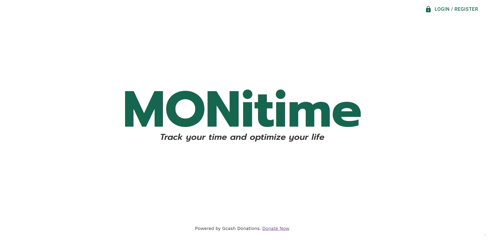

<!-- Improved compatibility of back to top link: See: https://github.com/othneildrew/Best-README-Template/pull/73 -->

<a name="readme-top"></a>

<!-- PROJECT LOGO -->
<br />
<div align="center">
  <a href="">
    
  </a>

<h3 align="center">MONitime</h3>

  <p align="center">
    A time tracking web app to help you track your time and optimize your life.
    <br />
    <a href="#"><strong>Explore the repo</strong></a>
    <br />
    <br />
    <a href="#">View Demo</a>
  </p>
</div>

<!-- ABOUT THE PROJECT -->

## About The Project



MONitime is a time monitoring app allowing users to track their daily activities and the time they spend on them. By logging, tracking, analyzing and summarizing the data, the app help users become more productive and efficient by identifying areas where they need to adjust their time allocation depending on their personal goals and target.


### Built With

- [![React][React.js]][React-url]
- [![React][React.js]][React-url]
- [![Modern JS][Modern-JS-badge]][Modern-JS-url]
- [![React.js][React-js-badge]][React-js-url]
- [![MaterialUI][Material-UI-badge]][Material-UI-url]
- [![Node.js][Node-js-badge]][Node-js-url]
- [![Express.js][Express-js-badge]][Express-js-url]
- [![MongoDB][MongoDB-badge]][MongoDB-url]

<!-- GETTING STARTED -->

## Getting Started

This is an example of how you may give instructions on setting up your project
locally. To get a local copy up and running follow these simple example steps.

### Prerequisites

This is an example of how to list things you need to use the software and how to
install them.

- npm
  ```sh
  npm install npm@latest -g
  ```

### Installation

1. Get a free API Key at [https://example.com](https://example.com)
2. Clone the repo
   ```sh
   git clone https://github.com/github_username/repo_name.git
   ```
3. Install NPM packages
   ```sh
   npm install
   ```
4. Enter your API in `config.js`
   ```js
   const API_KEY = "ENTER YOUR API";
   ```

<p align="right">(<a href="#readme-top">back to top</a>)</p>

<!-- USAGE EXAMPLES -->

## Usage

Use this space to show useful examples of how a project can be used. Additional
screenshots, code examples and demos work well in this space. You may also link
to more resources.

_For more examples, please refer to the [Documentation](https://example.com)_

<p align="right">(<a href="#readme-top">back to top</a>)</p>

<!-- ROADMAP -->

## Roadmap

- [ ] Feature 1
- [ ] Feature 2
- [ ] Feature 3
  - [ ] Nested Feature

See the [open issues](https://github.com/github_username/repo_name/issues) for a
full list of proposed features (and known issues).

<p align="right">(<a href="#readme-top">back to top</a>)</p>

<!-- CONTRIBUTING -->

## Contributing

Contributions are what make the open source community such an amazing place to
learn, inspire, and create. Any contributions you make are **greatly
appreciated**.

If you have a suggestion that would make this better, please fork the repo and
create a pull request. You can also simply open an issue with the tag
"enhancement". Don't forget to give the project a star! Thanks again!

1. Fork the Project
2. Create your Feature Branch (`git checkout -b feature/AmazingFeature`)
3. Commit your Changes (`git commit -m 'Add some AmazingFeature'`)
4. Push to the Branch (`git push origin feature/AmazingFeature`)
5. Open a Pull Request

<p align="right">(<a href="#readme-top">back to top</a>)</p>

<!-- LICENSE -->

## License

Distributed under the MIT License. See `LICENSE.txt` for more information.

<p align="right">(<a href="#readme-top">back to top</a>)</p>

<!-- CONTACT -->

## Contact

Your Name - [@twitter_handle](https://twitter.com/twitter_handle) -
email@email_client.com

Project Link:
[https://github.com/github_username/repo_name](https://github.com/github_username/repo_name)

<p align="right">(<a href="#readme-top">back to top</a>)</p>

<!-- ACKNOWLEDGMENTS -->

## Acknowledgments

- []()
- []()
- []()

<p align="right">(<a href="#readme-top">back to top</a>)</p>

<!-- MARKDOWN LINKS & IMAGES -->
<!-- https://www.markdownguide.org/basic-syntax/#reference-style-links -->

[linkedin-shield]:
  https://img.shields.io/badge/-LinkedIn-black.svg?style=for-the-badge&logo=linkedin&colorB=555
[linkedin-url]: https://linkedin.com/in/linkedin_username
[React.js]: https://img.shields.io/badge/React-20232A?style=for-the-badge&logo=react&logoColor=61DAFB
[React.js-url]: https://reactjs.org/
[Modern-JS-url]: https://www.modernjs.com/
[React-js-url]: https://reactjs.org/
[Material-UI-url]: https://mui.com/
[Node-js-url]: https://nodejs.org/
[Express-js-url]: https://expressjs.com/
[MongoDB-url]: https://www.mongodb.com/

[Modern-JS-badge]: https://img.shields.io/badge/-Modern%20JS-orange
[React-js-badge]: https://img.shields.io/badge/-React.js-blue
[Material-UI-badge]: https://img.shields.io/badge/-MaterialUI-green
[Node-js-badge]: https://img.shields.io/badge/-Node.js-green
[Express-js-badge]: https://img.shields.io/badge/-Express.js-blue
[MongoDB-badge]: https://img.shields.io/badge/-MongoDB-brightgreen

